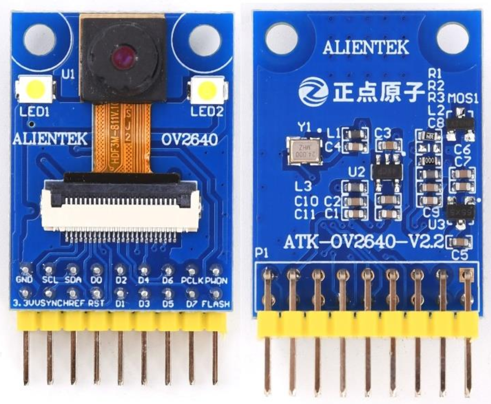
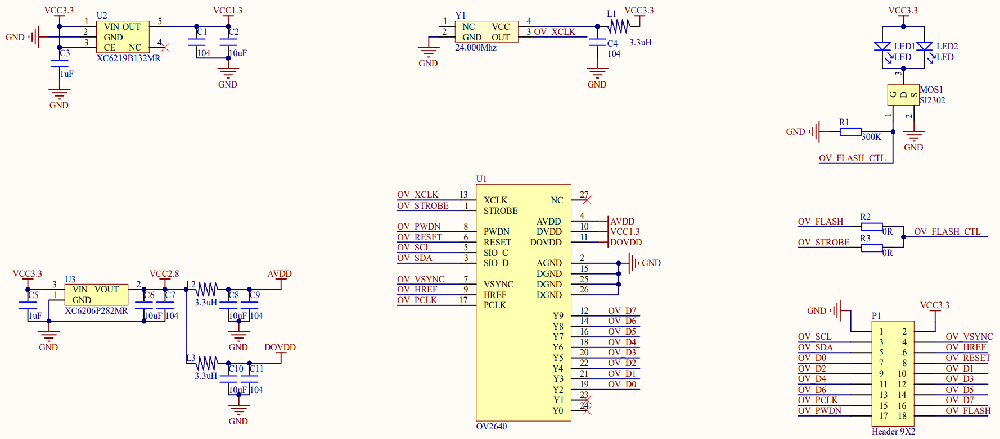

## 1 Introduction

### 1.1 Appearence

The ATK-MD2640 module looks like this:

### 1.2 Features

The ATK-MC2640 module is a high-performance 200W high-definition camera module launched by ALIENTEK. This module uses OmniVision's OV2640 camera sensor as the core, which is a 1/4-inch CMOS UXGA (1632 * 1232) image sensor. At the same time, the ATK-MC2640 module integrates active crystal oscillators and LDO chips.

### 1.3 Parameter

Here are the product basic parameters:

| Parameter                   | Describe                                                     |
| --------------------------- | ------------------------------------------------------------ |
| Communication Interface     | Control interface: SCCB protocol (compatible with IIC protocol) Data interface: 8-bit data |
| Output Formats(8-bit)       | 8-/10-bit Raw RGB data RGB（GBR422、RGB565、RGB555） YUV422、YUV420 YCbCr422 JPEG |
| Output bit width            | 8-bit                                                        |
| Output Pixels               | UXGA (1600 * 1200) and any size up to 40 * 30                |
| Naximum image Transfer Rate | UXGA:15fps SVGA:30fps CIF:60fps                      |
| Lens Size                   | 1/4 inch                                                     |
| Sensitivity                 | 0.6V/Lux-sec                                                 |
| S/N Ratio                   | 40dB                                                         |
| Dynamic Range               | 50dB                                                         |
| Lens aperture               | F2.0                                                         |
| Camera perspective          | 78°                                                          |
| focal length                | 3.6mm                                                        |
| Lens filter                 | 850nm                                                        |
| Temperature Range           | -30℃~70℃                                                     |
| Module size                 | 24mm*32mm                                                    |

The electrical parameters are shown in the following table:

| Parameter         | Describe                  |
| ----------------- | ------------------------- |
| Supply voltage    | 3.3V                      |
| IO port level     | 2.8V,compatible with 3.3V |
| Power dissipation | 40mA                      |

### 1.4 Interface

The ATK-MC2640 module is connected to an external circuit through a 2 * 9 pin . The detailed description of each pin is shown in the table below.

| Number | Name  | Describe                                   |
| ------ | ----- | ------------------------------------------ |
| 1      | GND   | Power ground                               |
| 2      | 3V3   | 3V3 power supply                           |
| 3      | SCL   | SCCB serial interface clock input          |
| 4      | VSYNC | Vertical synchronization output            |
| 5      | SDA   | SCCB serial interface data I/O             |
| 6      | HREF  | Horizontal reference output                |
| 7      | D0    | Video port output bit[0]                   |
| 8      | RESET | Reset OV2640                               |
| 9~14   | D1~D6 | Video port output bit[1:6]                 |
| 15     | PCLK  | Pixel clock output                         |
| 16     | D7    | Video port output bit[7]                   |
| 17     | PWDN  | Power-down mode enable, active high        |
| 18     | FLASH | External control flash signal, active high |

## 2 Schematic

The schematic diagram of the ATK-MD2640 module is shown as follows.

